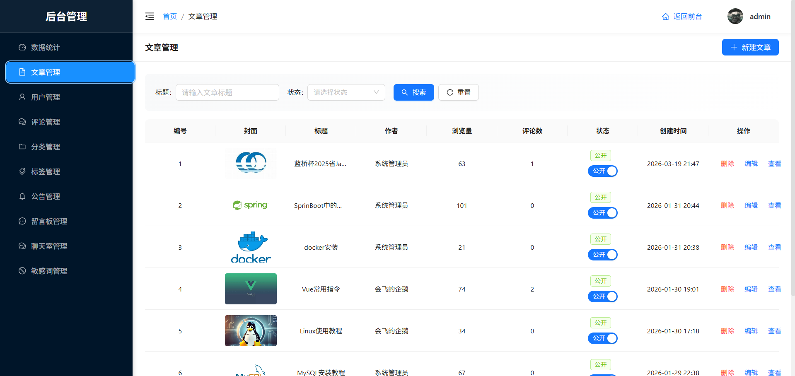
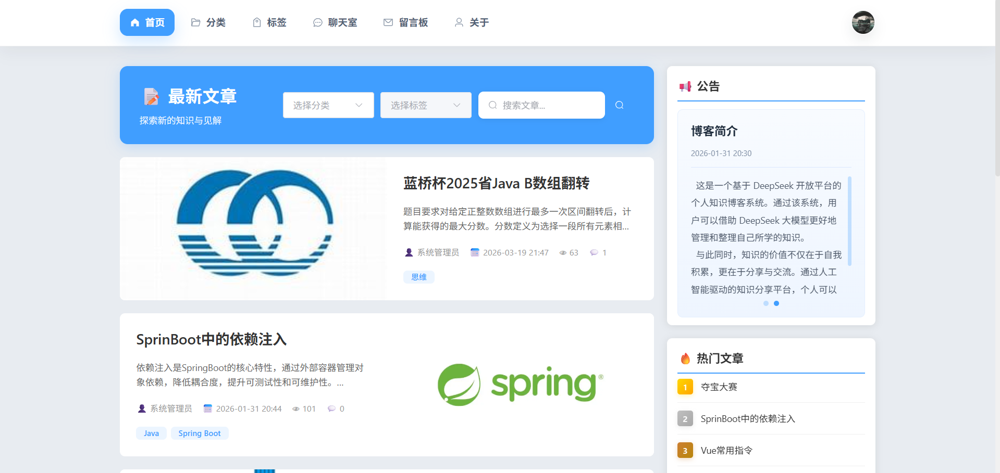
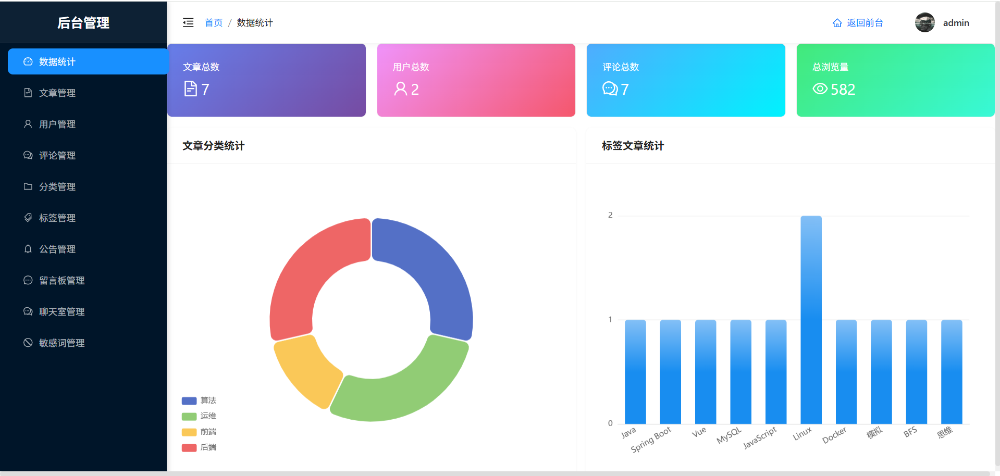
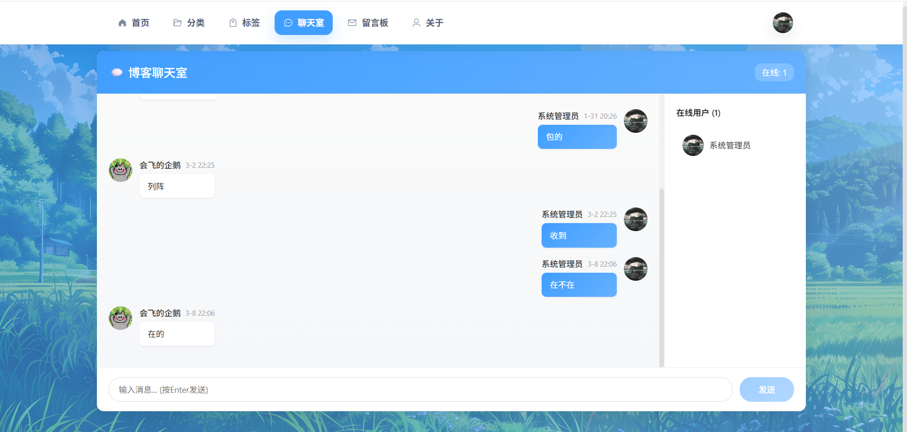
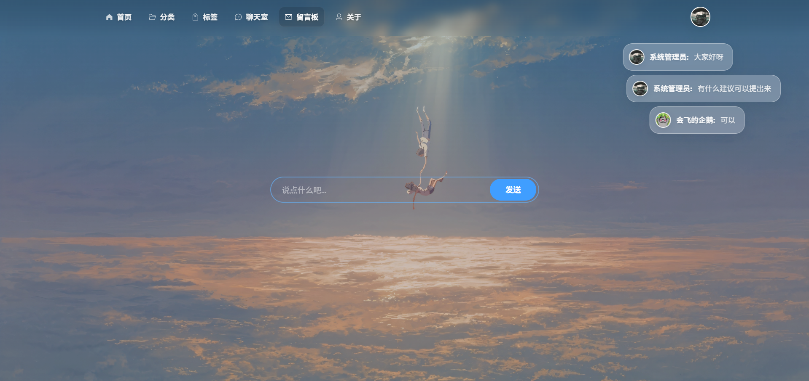

<div align="center">
个人知识博客系统


一个功能完善的全栈博客系统，集成 DeepSeek AI 智能助手，支持实时聊天、留言弹幕、敏感词过滤等特色功能。

</div>

---

## 📖 项目简介

这是一个基于 **Vue 3 + Spring Boot 3** 开发的现代化博客系统，采用前后端分离架构，集成了 DeepSeek AI 智能助手，提供丰富的内容管理和社交互动功能。

### ✨ 核心亮点

- 🤖 **AI 智能助手** - 集成 DeepSeek API，支持文章生成、内容优化、智能问答
- 💬 **实时聊天室** - 基于 WebSocket 的实时通讯，支持在线用户显示
- 🎯 **弹幕留言板** - 创新的留言展示方式，支持弹幕效果
- 🛡️ **敏感词过滤** - 智能内容审核，保障社区环境
- 📝 **Markdown 编辑器** - 强大的 md-editor-v3 编辑器，支持实时预览
- 🎨 **现代化 UI** - Element Plus + Ant Design Vue 双组件库
- 🔐 **完善的权限系统** - JWT 认证，角色权限管理
- 📊 **数据统计** - 文章浏览、用户活跃度等多维度统计

---

## 🛠️ 技术栈

### 后端技术

| 技术 | 版本 | 说明 |
|------|------|------|
| Spring Boot | 3.0.6 | 核心框架 |
| JDK | 17 | Java 开发环境 |
| MyBatis Plus | 3.5.7 | ORM 框架 |
| MySQL | 8.0 | 关系型数据库 |
| Redis | 7.x | 缓存 + 会话管理 |
| MinIO | 8.5.7 | 对象存储服务 |
| JJWT | 0.12.5 | 用户认证 |
| WebSocket | - | 实时通讯 |
| Hutool | 5.8.24 | Java 工具库 |
| Lombok | - | 简化代码 |
| Swagger | 2.3.0 | API 文档 |

### 前端技术

| 技术 | 版本 | 说明 |
|------|------|------|
| Vue | 3.4 | 渐进式框架 |
| Vite | 5.0 | 构建工具 |
| Element Plus | 2.5 | UI 组件库 |
| Ant Design Vue | 4.x | UI 组件库 |
| Pinia | 2.x | 状态管理 |
| Vue Router | 4.x | 路由管理 |
| Axios | 1.x | HTTP 客户端 |
| Vditor | 3.x | Markdown 编辑器 |
| Vue3 Danmaku | 6.3.1 | 弹幕组件 |
| Day.js | 1.11.10 | 时间处理 |

### AI 集成

- **DeepSeek API** - 提供智能对话、内容生成等 AI 能力
- **SSE (Server-Sent Events)** - 实现流式响应

---

## 📁 项目结构

```
blog-project/
├── blog-backend/                 # 后端项目
│   ├── src/main/
│   │   ├── java/com/blog/
│   │   │   ├── common/          # 公共类（Result、PageResult 等）
│   │   │   ├── config/          # 配置类
│   │   │   │   ├── CorsConfig.java
│   │   │   │   ├── SecurityConfig.java
│   │   │   │   ├── RedisConfig.java
│   │   │   │   ├── MinioConfig.java
│   │   │   │   └── WebSocketConfig.java
│   │   │   ├── controller/      # 控制器
│   │   │   │   ├── ArticleController.java
│   │   │   │   ├── UserController.java
│   │   │   │   ├── CommentController.java
│   │   │   │   ├── ChatRoomController.java
│   │   │   │   ├── MessageController.java
│   │   │   │   └── AIController.java
│   │   │   ├── dto/             # 数据传输对象
│   │   │   ├── entity/          # 实体类
│   │   │   ├── vo/              # 视图对象
│   │   │   ├── mapper/          # MyBatis Mapper
│   │   │   ├── service/         # 业务层
│   │   │   │   └── impl/        # 业务实现
│   │   │   ├── interceptor/     # 拦截器
│   │   │   ├── exception/       # 异常处理
│   │   │   └── utils/           # 工具类
│   │   │       ├── JwtUtil.java
│   │   │       ├── RedisUtil.java
│   │   │       └── SensitiveWordUtil.java
│   │   └── resources/
│   │       ├── application.yml  # 配置文件
│   │       └── sensitive-words.txt
│   └── pom.xml
│
├── blog-frontend/               # 前端项目
│   ├── src/
│   │   ├── api/                # API 接口封装
│   │   │   ├── request.js      # Axios 配置
│   │   │   ├── article.js
│   │   │   ├── user.js
│   │   │   ├── comment.js
│   │   │   ├── chatroom.js
│   │   │   ├── message.js
│   │   │   └── ai.js
│   │   ├── assets/             # 静态资源
│   │   │   ├── images/         # 图片资源
│   │   │   │   ├── bg1.png ~ bg4.png
│   │   │   │   └── dp.png
│   │   │   └── styles/         # 样式文件
│   │   ├── components/         # 公共组件
│   │   │   ├── Header.vue
│   │   │   ├── CommentSection.vue
│   │   │   ├── AIAssistant.vue
│   │   │   ├── ArticleAIChat.vue
│   │   │   └── ImageUpload.vue
│   │   ├── router/             # 路由配置
│   │   │   └── index.js
│   │   ├── stores/             # Pinia 状态管理
│   │   │   └── user.js
│   │   ├── utils/              # 工具函数
│   │   │   └── chatWebSocket.js
│   │   ├── views/              # 页面组件
│   │   │   ├── Home.vue        # 首页
│   │   │   ├── Login.vue       # 登录
│   │   │   ├── Register.vue    # 注册
│   │   │   ├── ArticleDetail.vue
│   │   │   ├── Editor.vue      # 文章编辑器
│   │   │   ├── Categories.vue  # 分类页
│   │   │   ├── Tags.vue        # 标签页
│   │   │   ├── ChatRoom.vue    # 聊天室
│   │   │   ├── Guestbook.vue   # 留言板
│   │   │   ├── About.vue       # 关于页
│   │   │   ├── admin/          # 管理后台
│   │   │   │   ├── Layout.vue
│   │   │   │   ├── Dashboard.vue
│   │   │   │   ├── Articles.vue
│   │   │   │   ├── Users.vue
│   │   │   │   ├── Comments.vue
│   │   │   │   ├── Categories.vue
│   │   │   │   ├── Tags.vue
│   │   │   │   ├── ChatRoom.vue
│   │   │   │   ├── Messages.vue
│   │   │   │   └── Announcements.vue
│   │   │   └── user/           # 用户中心
│   │   │       ├── Layout.vue
│   │   │       ├── Dashboard.vue
│   │   │       ├── Articles.vue
│   │   │       ├── Comments.vue
│   │   │       ├── Messages.vue
│   │   │       └── ChatMessages.vue
│   │   ├── App.vue
│   │   └── main.js
│   ├── index.html
│   ├── package.json
│   └── vite.config.js
│
└── READEME.md
```

---

## 🚀 快速开始

### 环境要求

确保你的开发环境满足以下要求：

- **JDK**: 17 或更高版本
- **Node.js**: 18+ 或 20+
- **MySQL**: 8.0+
- **Redis**: 7.x
- **Maven**: 3.8+
- **MinIO**: Latest (可选)

### 1️⃣ 克隆项目

```bash
git clone https://github.com/your-username/blog-project.git
cd blog-project
```

### 2️⃣ 数据库初始化

```bash
# 登录 MySQL
mysql -u root -p

# 创建数据库
CREATE DATABASE blog_system CHARACTER SET utf8mb4 COLLATE utf8mb4_unicode_ci;

# 使用数据库
USE blog_system;

# 执行建表脚本
source docs/blog_system.sql
```

### 3️⃣ 配置后端

编辑 `blog-backend/src/main/resources/application.yml`：

```yaml
spring:
  datasource:
    url: jdbc:mysql://localhost:3306/blog_system?useUnicode=true&characterEncoding=utf8&useSSL=false&serverTimezone=Asia/Shanghai
    username: root
    password: your_password
    
  data:
    redis:
      host: localhost
      port: 6379
      password: # 如果有密码请填写
      
minio:
  endpoint: http://localhost:9000
  accessKey: minioadmin
  secretKey: minioadmin
  bucketName: blog
  
deepseek:
  api:
    key: your-deepseek-api-key-here
    url: https://api.deepseek.com
```

### 4️⃣ 启动后端

```bash
cd blog-backend

# 使用 Maven 启动
mvn clean install
mvn spring-boot:run

# 或者使用 IDE 直接运行 BlogApplication.java
```

后端启动成功后：
- API 地址: http://localhost:8080/api
- Swagger 文档: http://localhost:8080/api/swagger-ui.html
- Druid 监控: http://localhost:8080/api/druid/

### 5️⃣ 启动前端

```bash
cd blog-frontend

# 安装依赖
npm install
# 或使用 pnpm (推荐)
pnpm install

# 启动开发服务器
npm run dev
```

前端启动成功后访问: http://localhost:3000

### 6️⃣ 配置 MinIO (可选)

使用 Docker 快速启动 MinIO：

```bash
docker run -d \
  -p 9000:9000 \
  -p 9001:9001 \
  --name minio \
  -e "MINIO_ROOT_USER=minioadmin" \
  -e "MINIO_ROOT_PASSWORD=minioadmin" \
  -v /data/minio:/data \
  minio/minio server /data --console-address ":9001"
```

访问 MinIO 控制台: http://localhost:9001

创建名为 `blog` 的 bucket，并设置为公开访问。

### 7️⃣ 配置 Redis

```bash
# 使用 Docker 启动 Redis
docker run -d \
  -p 6379:6379 \
  --name redis \
  redis:7-alpine
```
---

## 🎯 功能特性

### 📝 文章管理


#### 前台功能


#### 编辑器功能


#### 后台管理


### 💬 评论系统


### 💭 聊天室


### 📮 留言板


#### 编辑器 AI 助手


#### 文章页 AI 助手


---

### 数据库设计

主要数据表：
- `user` - 用户表
- `article` - 文章表
- `category` - 分类表
- `tag` - 标签表
- `article_tag` - 文章标签关联表
- `comment` - 评论表
- `comment_like` - 评论点赞表
- `chatroom_message` - 聊天室消息表
- `message` - 留言表
- `announcement` - 公告表
- `sensitive_word` - 敏感词表

## 📄 开源协议

本项目采用 [MIT](LICENSE) 协议开源。

---

## 🙏 致谢

感谢以下开源项目和工具：

- [Element Plus](https://element-plus.org/)
- [Ant Design Vue](https://antdv.com/)
- [MyBatis Plus](https://baomidou.com/)
- [md-editor-v3](https://github.com/imzbf/md-editor-v3)
- [vue-danmaku](https://github.com/hellodigua/vue-danmaku)
- [Hutool](https://hutool.cn/)
- [Ruyu-Blog](https://gitee.com/kuailemao/ruyu-blog)

---
